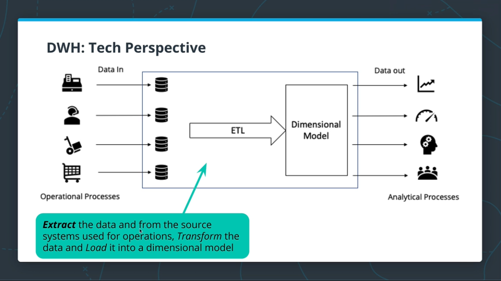
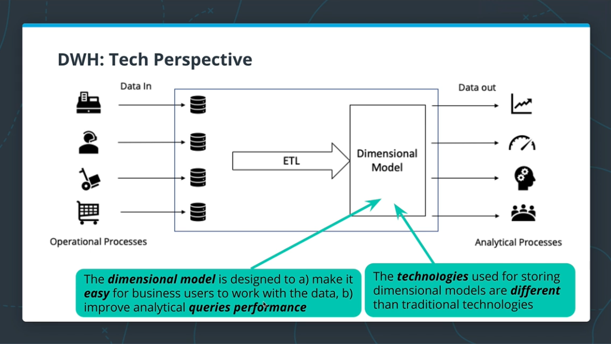

Operational Databases:
- Excellent for operations as they have no redundancy and high integrity.

 

Same data sources for operational & analytical processes?
- it will work, but it will be very slow for analytics because of the too many joins and to complex schema duo to normalization.

 

A solution is to create two processing modes
- **OLTP**: online transactional processing for the operational part, optimize for low-latency and low volume queries
- **OLAP**: online analytical processing for the analytical part, optimize for large volume and group by queries, minimizes joins

 

Data Warehouse is a system including processes, technologies and data representation that enables us to support analytical processes.

 

# Data Warehouse:
- **Definition 1** -> a copy of transaction data specifically structured for query and analysis.
- **Definition 2** -> a subject-orientated, integrated, nonvolatile and time variant collection of data in support of management decisions.
- **Definition 3** -> a system that retrieves and consolidate data periodically from the source system into a dimensional or normalized data store (ETL), it usually keeps years of history and is queried for business inelegance or other analytical activities. It is typically updated in batches, not every time a transaction happens in the source system.

 

The flow:

The technologies used in the source databases and in the dimensional model in the dwh are different, because one is optimized for inserting and one for read.

 

 

### DWH Goals:
- Simple to understand
- Performant
- Quality Assured 
- Handles new Questions well
- Secure

 
 

### Dimensional Modeling Goals
- Easy to understand 
- Fast analytical query performance

-> **Star schema**: joins with dimensions only, good for OLAP not OLTP
-> **3NF schema**: lots of expensive joins, hard to explain to businesses users.

 

### Facts and Dimensions
#### Facts tables:
- record business events, like an order, a phone call, a book review
- fact tales columns record events recorded in quantifiable metrics like quantity of an item, duration of a call, a book rating.

 

- Facts are usually numeric and additive.
- a comment on an article represents an event, but it's not a good fact
- invoice number is numeric but adding it doesn't make scene, not a good fact
- total amount of an invoice could e added to compute total sales, a good fact

 

#### Dimension tables:
- record the context of a business event, (who, what, where, why, ....)
- Dimension tables columns contain attributes like the store at wish an item was purchased, or the customer who made the call.

 

- Date and Time are always a dims
- Physical locations and their attributes are good dims
- Human roles like customer and staff are good dims

#### Dimensions comes in two flavors:
- **Slowly-changing** -> it changes with time like your favorite food, or the price of an item, age, current country 
- **Fixed** -> it doesn't change with time like the birth date, or the phone manufacture (easier)

#### How can you model dimensions that change?
it depends on how slow or how rapidly it changes, but generally there are 3 ways
- **Singular snapshot** -> only takes the last snapshot of the data, it neglects all past records of a dimension, all the dimensional values of the old data would pull in the latest value which might not e correct for the older data, for the most part just never do this

 

- **Daily partitioned snapshots** -> simple, every day we have a value for a dimension and we just use it for that day.

 

- **SCD** (slowly changing dimension) types 0,1,2,3
	- **Type 0** -> isn't actually slowly changing whatsoever (e.g. birth date), you have a table with the identifier column of the entity and then the dimension value and that's it.
	- **Type 1** -> The value changes but you only care about the latest value, generally never use this for data engineers who cares about analytics, it's okay for OLTP but not with OLAP. And also it makes the pipeline not idempotent.
	- **Type 2** -> 
		- you care about what the value was from a `start_date` to an `end_date`
		- current values usually have either an `end_date` that is `NULL` or some year for into the future like `9999-12-31`
		- hard to use since there are more than one row per dimension, you need to e careful when filtering on time
		- the only type of SCD that is purely idempotent
		- sometimes there is a boolean column `is_cuurent` to indicate the current value for the table
	 - **Type 3** -> 
		 - instead of holding on all values like in type 2, you only hold on the `current` and the `original`
		 - it's somewhat a middle ground, but if your dimension change more than once, then you lose that history
		 - a benefit is that you only have one row per dimension, so no need for filtering.
		 - not idempotent

 

We go from 3NF to Star with ETL
- query the 3NF DB (Extract)
- join tables together (Transform)
- change types (Transform)
- add new columns (Transform)
- inserting into facts and dimension tables (Load)