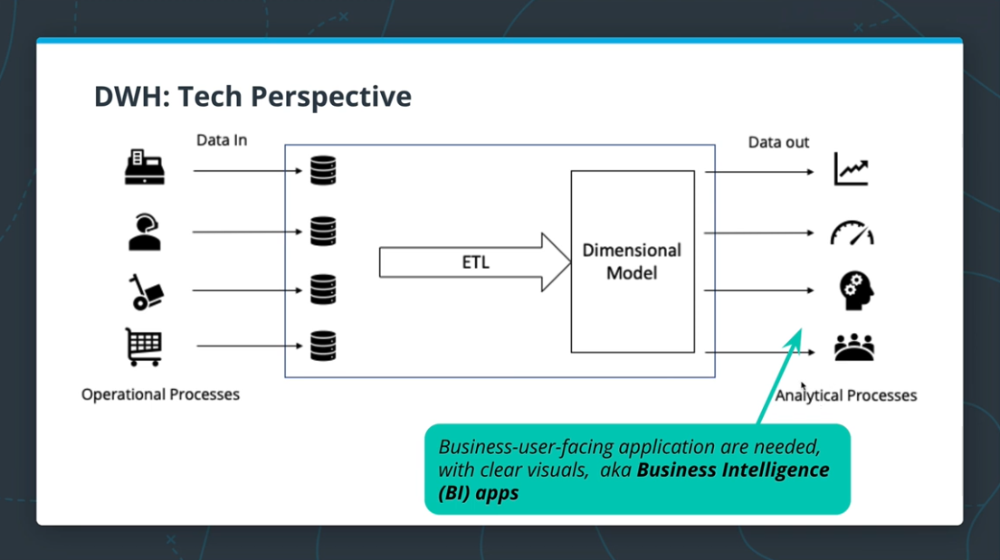

# Code & Exercises 
- You can find the environment setup of `docker` with `postgres` and `jupyter` along with the notebooks which cover the below content in practice, all inside the `dwh-notebooks-exercises-with-postgres` folder
- Below is a general theory explanation while the `dwh-notebooks-exercises-with-postgres` folder has all the code and practice.

<br/>
<br/>

# Some  Recap 
Operational Databases:
- Excellent for operations as they have no redundancy and high integrity.

<br/>

Same data sources for operational & analytical processes?
- it will work, but it will be very slow for analytics because of the too many joins and too complex schema duo to normalization.

<br/>

A solution is to create two processing modes
- **OLTP**: online transactional processing for the operational part, optimize for low-latency and low volume queries
- **OLAP**: online analytical processing for the analytical part, optimize for large volume and group by queries, minimizes joins

<br/>

Data Warehouse is a system including processes, technologies and data representation that enables us to support analytical processes.

<br/>
<br/>

# Data Warehouse:
- **Definition 1** -> a copy of transaction data specifically structured for query and analysis.
- **Definition 2** -> a subject-orientated, integrated, nonvolatile and time variant collection of data in support of management decisions.
- **Definition 3** -> a system that retrieves and consolidate data periodically from the source system into a dimensional or normalized data store (ETL), it usually keeps years of history and is queried for business inelegance or other analytical activities. It is typically updated in batches, not every time a transaction happens in the source system.

<br/>

#### The flow:


The technologies used in the source databases and in the dimensional model in the dwh are different, because one is optimized for inserting and one for read.

<br/>



<br/>

### DWH Goals:
- Simple to understand
- Performant
- Quality Assured 
- Handles new Questions well
- Secure

<br/>
<br/>

### Dimensional Modeling Goals
- Easy to understand 
- Fast analytical query performance

<br/>

### Facts and Dimensions
### Facts tables:
- record business events, like an order, a phone call, a book review
- fact tales columns record events recorded in quantifiable metrics like quantity of an item, duration of a call, a book rating.
- Facts are usually numeric and additive.
- a comment on an article represents an event, but it's not a good fact
- invoice number is numeric but adding it doesn't make scene, not a good fact
- total amount of an invoice could e added to compute total sales, a good fact

<br/>

### Dimension tables:
- record the context of a business event, (who, what, where, why, ....)
- Dimension tables columns contain attributes like the store at wish an item was purchased, or the customer who made the call.
- Date and Time are always a dims
- Physical locations and their attributes are good dims
- Human roles like customer and staff are good dims


### Dimensions comes in two flavors:
- **Slowly-changing** -> it changes with time like your favorite food, or the price of an item, age, current country 
- **Fixed** -> it doesn't change with time like the birth date, or the phone manufacture (easier)

<br/>

### How can you model dimensions that change?
it depends on how slow or how rapidly it changes, but generally there are 3 ways
- **Singular snapshot** -> only takes the last snapshot of the data, it neglects all past records of a dimension, all the dimensional values of the old data would pull in the latest value which might not e correct for the older data, for the most part just never do this

<br/>

- **Daily partitioned snapshots** -> simple, every day we have a value for a dimension and we just use it for that day.

<br/>

- **SCD** (slowly changing dimension) types 0,1,2,3
	- **Type 0** -> isn't actually slowly changing whatsoever (e.g. birth date), you have a table with the identifier column of the entity and then the dimension value and that's it.
	- **Type 1** -> The value changes but you only care about the latest value, generally never use this for data engineers who cares about analytics, it's okay for OLTP but not with OLAP. And also it makes the pipeline not idempotent.
	- **Type 2** -> 
		- you care about what the value was from a `start_date` to an `end_date`
		- current values usually have either an `end_date` that is `NULL` or some year for into the future like `9999-12-31`
		- hard to use since there are more than one row per dimension, you need to e careful when filtering on time
		- the only type of SCD that is purely idempotent
		- sometimes there is a boolean column `is_cuurent` to indicate the current value for the table
	 - **Type 3** -> 
		 - instead of holding on all values like in type 2, you only hold on the `current` and the `original`
		 - it's somewhat a middle ground, but if your dimension change more than once, then you lose that history
		 - a benefit is that you only have one row per dimension, so no need for filtering.
		 - not idempotent

<br/>


-> **Star schema**: joins with dimensions only, good for OLAP not OLTP

-> **3NF schema**: lots of expensive joins, hard to explain to businesses users.

<br/>

We go from 3NF to Star with ETL
- query the 3NF DB (Extract)
- join tables together (Transform)
- change types (Transform)
- add new columns (Transform)
- inserting into facts and dimension tables (Load)


<br/>
<br/>

# DWH Architectures
Over the years engineers have tried to build dwh differently optimizing for different factors, here are some of the most famous:
- Kimball's Bus Architecture 
- Independent Data Marts
- Inmon's Corporate Information Factory (CIF)
- Hybrid Bus & CIF

<br/>

## Kimball's Bus Architecture 

- This architecture uses conformed dimensions, meaning all business departments have the same data dimensions, but not all of them have access to all dimensions
- Data is not kept at the aggregated level, but rather at the atomic level

<br/>

## Independent Data Marts

- Departments have independent ETL processes and dimensional models
- These **separate and smaller** dimensional models are called `Data Marts`
- Different fact tables for the same events, **no conformed dimensions**
- Uncoordinated efforts can lead to inconsistent views
- It's a smaller data model focused only one department
- Independent Data Marts have ETL processes that are designed by specific business departments to meet their analytical needs


<br/>

## Inmon's Corporate Information Factory (CIF)

- First ETL is to get an improved copy of the sources (called enterprise dwh), so that all departments can have the same source of truth for their data marts, this tries to make some balance on Independence between departments doing their data marts (not having totally independent ETLs that can lead to inconsistencies)
- 2 ETL Processes
	- Source system -> 3NF DB (enterprise dwh) (data acquisition)
	- 3NF DB -> Departmental data marts (data delivery)
- The 3NF DB acts as an enterprise wide datastore
	- Single integrated source of truth for all data marts
	- Could e accessed by end users if needed
- Data marts dimensional modeled and unlike Kimball's they are mostly aggregated
- The Enterprise Data Warehouse provides a normalized data architecture before individual departments build on it
- The Data Marts use a source 3NF model and add denormalization based on department needs


<br/>

## Hybrid Bus & CIF

- This model replaced the data marts from CIF with one enterprise dwh to achieve conformed dimensions, taking the best of CIF and Kimball's

<br/>
<br/>

# OLAP Cubes
Once we are done building our facts and dimensions tables, we are now in a position to start queering and getting insights 


<br/>

## Roll-up & Drill-Down
- **Roll-Up:** Sum up the sales of each city by country, we went from city (more details) to country (less details) (less columns and rows in branch dimension). To do this our level of granularity should include cites in the first place.
- **Drill-Down**: Decompose the sales of each city into smaller districts (more columns and rows in branch dimension). To do this our level of granularity should include districts in the first place.
- The OLAP cubes should store the finest grain of data (atomic data), in case we need to drill down to the lowest level, eg. Country -> City -> District -> Street.

<br/>

## Slice and Dice

We still have the movie ad branch dimensions but the month dimension is constant.


<br/>

## OLAP Cubes query optimization
- Business users will typically want to slice, dice, roll up and down all the time
```sql
GROUP BY CUBE(movie, branch, month)
```
- The `group by cube` will make one pass through the facts tables and will aggregate all possible combinations of groupings, of length 0, 1, 2, 3 eg:
	- Total revenue (0)
	- Revenue by movie - Revenue by branch - Revenue by month (1)
	- Revenue by movie, branch - Revenue by branch, month - Revenue by movie, month (2)
	- Revenue by movie, branch, month (3)
- Saving the output of the CUBE operation and using it is usually enough to answer all forthcoming aggregations from business users without having to process the whole facts table again.


<br/>
<br/>

# Data Warehouse Technologies
## Delivering the analytics to users
Data is available...
- In an understandable & performant dimensional model
- With Conformed dimensions or separate data marts
- For users to report and visualize
	- By interacting directly with model
	- Or in most cases, through BI applications
- OLAP cubes is a very convenient way for slicing, dicing and drilling

<br/>

## How do we serve these OLAP cubes? OLAB cubes technologies
- Approach 1: **Pre-aggregate** the OLAP cubes and saves them on a special purpose non-relational database (**MOLAP**)
- Approach 2: Compute the OLAP cubes **on the fly** from the existing relational databases where the dimensional model resides (**ROLAP**) (more common)
