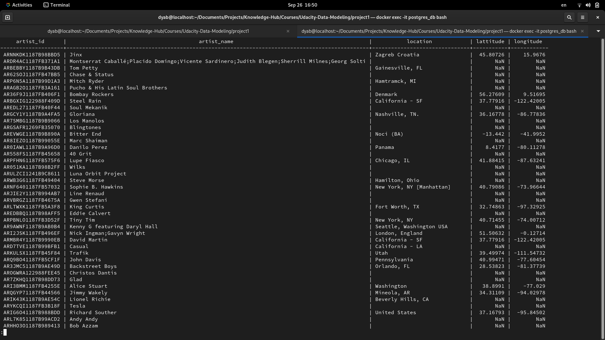
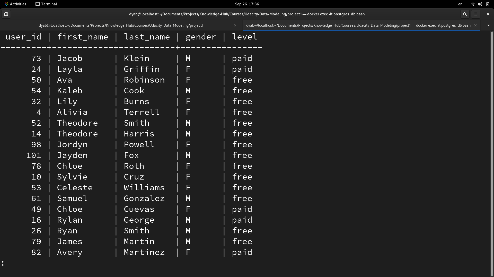

# Project: Data Modeling with Postgres

This project models user activity data for a music streaming app called Sparkify to optimize queries for understanding what songs users are listening to by creating a **Postgres relational database** and **ETL pipeline** to build up **Fact and Dimension tables** and insert data into new tables.

<br/>
<br/>

## Project Structure

```
Data Modeling with Postgres

|____data # Dataset
| |____log_data
| | |____...
| |____song_data
| | |____...


|____src # source code
| |____etl.py # ETL builder
| |____db_utils.py # ETL query helper functions
| |____sparkifydb_schema.sql # database schema
```

<br/>
<br/>

## ETL Pipeline

### etl.py

ETL pipeline builder

1. `process_data`
* Iterating dataset to apply `process_song_file` and `process_log_file` functions

2. `process_song_file`
* Process song dataset to insert record into _songs_ and _artists_ dimension table

3. `process_log_file`
* Process log file to insert record into _time_ and _users_ dimension table and _songplays_ fact table

  
<br/>
<br/>

### db_utils.py

Creating Fact and Dimension table schema
1. `create_database`
2. `drop_tables`
3. `create_tables`

<br/>

Helper SQL query statements
1. `*_table_insert`
2. `song_select`


<br/>
<br/>

## Database Schema

### Fact table
```
songplays
- songplay_id PRIMARY KEY
- start_time REFERENCES time (start_time)
- user_id REFERENCES users (user_id)
- level
- song_id REFERENCES songs (song_id)
- artist_id REFERENCES artists (artist_id)
- session_id
- location
- user_agent
```

  

### Dimension table

```
users
- user_id PRIMARY KEY
- first_name
- last_name
- gender
- level


songs
- song_id PRIMARY KEY
- title
- artist_id
- year
- duration

  

artists
- artist_id PRIMARY KEY
- name
- location
- latitude
- longitude
```


<br/>
<br/>
## Test run
---

- artists table


- users table
