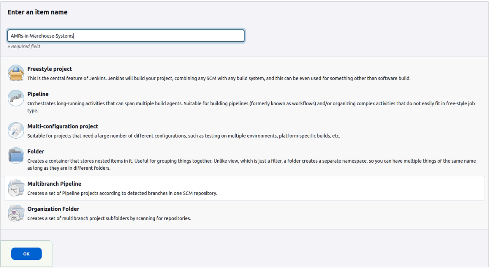
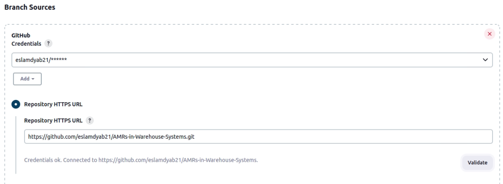
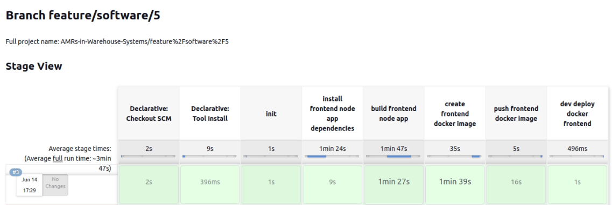

To install it using docker (recommended)
```bash
sudo docker run -p 8080:8080 -p 50000:50000 -d -v jenkins_home:/var/jenkins_home jenkins/jenkins:lts
```
- `-p 8080:8080 -p 50000:50000` are the ports which jenkins uses, so we are forwarding the packets from the container to the host on the same ports.
- `-v jenkins_home:/var/jenkins_home` is a volume to persists the data after restart.
  - where `jenkins_home` is the volume name reference in the host for the container 
  - and  `/var/jenkins_home` is where that volume is mounted inside the container
- `jenkins/jenkins:lts` is the jenkins version 

<br/>

After pulling the image the container is started automatically 👇 
```bash
root@debian-jenkins-server:~# docker ps
CONTAINER ID   IMAGE                 COMMAND                  CREATED         STATUS         PORTS                                                                                      NAMES
f6dfe4e246af   jenkins/jenkins:lts   "/usr/bin/tini -- /u…"   7 minutes ago   Up 7 minutes   0.0.0.0:8080->8080/tcp, :::8080->8080/tcp, 0.0.0.0:50000->50000/tcp, :::50000->50000/tcp   wizardly_nash
```
We can now access Jenkins through `localhost:8080`


We can find the password in the shown path (inside the container), note that this path `/var/jenkins_home` is what we set when during the installation.
```bash
root@debian-jenkins-server:~# docker exec -it f6dfe4e246af bash
jenkins@f6dfe4e246af:/$ cat /var/jenkins_home/secrets/initialAdminPassword
ed5af86bc0884a29833daa7e87fb1747
```

Note that hence we attached a volume to the previous location on our host, we can access the this info from our host too. We just need to find where docker saved the `jenkins_home` volume in the host
```bash
root@debian-jenkins-server:~# docker volume inspect jenkins_home
[
    {
        "CreatedAt": "2023-06-14T08:48:45-04:00",
        "Driver": "local",
        "Labels": null,
        "Mountpoint": "/var/lib/docker/volumes/jenkins_home/_data",
        "Name": "jenkins_home",
        "Options": null,
        "Scope": "local"
    }
]

root@debian-jenkins-server:~# ls /var/lib/docker/volumes/jenkins_home/_data
config.xml			identity.key.enc		  nodes			    secrets	 war
copy_reference_file.log		jenkins.telemetry.Correlator.xml  plugins		    updates
hudson.model.UpdateCenter.xml	jobs				  secret.key		    userContent
hudson.plugins.git.GitTool.xml	nodeMonitors.xml		  secret.key.not-so-secret  users

root@debian-jenkins-server:~# cat /var/lib/docker/volumes/jenkins_home/_data/secrets/initialAdminPassword 
ed5af86bc0884a29833daa7e87fb1747
```


Now we can proceed with the user setup in jenkins ui.


</br>

### Setup a multi-branch pipeline 


We will need to add our git-hub account credentials (username and token) then the repository link

After that jenkins will start to scan the repo and its branches to fine any jenkins files to run its pipelines.




</br>
</br>

### Install packages in jenkins

#### Nodejs

To install packages like `nodejs` navigate to `Dashboard - Manage Jenkins - Plugins - Avalible plugins`
Then go to `tools` we will find `Nodejs` at the button, click on it and choose the version you want than save. It will get downloaded and installed automatically when first using it inside a pipeline.


<br/>

#### Docker 
We can install it on the container normally from the internet `docker exec -it id bash`, but we already have it installed on the host, we actually can copy it to the container. 

```bash
root@debian-jenkins-server:~# docker ps
CONTAINER ID   IMAGE                 COMMAND                  CREATED          STATUS         PORTS                                                                                      NAMES
f6dfe4e246af   jenkins/jenkins:lts   "/usr/bin/tini -- /u…"   42 minutes ago   Up 4 seconds   0.0.0.0:8080->8080/tcp, :::8080->8080/tcp, 0.0.0.0:50000->50000/tcp, :::50000->50000/tcp   wizardly_nash

root@debian-jenkins-server:~# docker stop f6dfe4e246af

root@debian-jenkins-server:~# docker run -p 8080:8080 -p 50000:50000 -d \
> -v jenkins_home:/var/jenkins_home \
> -v /var/run/docker.sock:/var/run/docker.sock \
> -v $(which docker):/usr/bin/docker jenkins/jenkins:lts
6e9be07aaa3f7a0282c7f536780e00b3fb7ee606b45ae41b6edad874f6ede282

root@debian-jenkins-server:~# docker ps
CONTAINER ID   IMAGE                 COMMAND                  CREATED              STATUS              PORTS                                                                                      NAMES
6e9be07aaa3f   jenkins/jenkins:lts   "/usr/bin/tini -- /u…"   About a minute ago   Up About a minute   0.0.0.0:8080->8080/tcp, :::8080->8080/tcp, 0.0.0.0:50000->50000/tcp, :::50000->50000/tcp   ecstatic_banach
```

Now the container is running with the docker files, we can now use docker commands with our pipelines inside the jenkins container.
```bash
root@debian-jenkins-server:~# docker exec -it 6e9be07aaa3f bash

jenkins@6e9be07aaa3f:/$ docker run redis
docker: permission denied while trying to connect to the Docker daemon socket at unix:///var/run/docker.sock: Post "http://%2Fvar%2Frun%2Fdocker.sock/v1.24/containers/create": dial unix /var/run/docker.sock: connect: permission denied.
See 'docker run --help'.

jenkins@6e9be07aaa3f:/$ ls -l /var/run/docker.sock
srw-rw---- 1 root 998 0 Jun 14 12:34 /var/run/docker.sock
```
But there is one small problem, hence we coped it from the host, it has the host users permissions only, not the jenkins container user, to fix this we need to login as admin to jenkins container and `chmod`

```bash
jenkins@6e9be07aaa3f:/$ exit
exit

root@debian-jenkins-server:~# docker exec -u 0 -it 6e9be07aaa3f bash
root@6e9be07aaa3f:/# chmod 666 /var/run/docker.sock

root@6e9be07aaa3f:/# ls -l /var/run/docker.sock
srw-rw-rw- 1 root 998 0 Jun 14 12:34 /var/run/docker.sock
```

After adding the docker credentials we can use it in our project pipelines.


</br>
</br>

### Jenkins syntax example
Its written in groovy (Java syntax)

jenkins file needs to be names `Jenkinsfile` and it consists of multiple concurrent stages.
```groovy
#!/usr/bin/env groovy

def gv_job_script

pipeline {
    agent any
    tools {
        nodejs '20.2.0'
    }

    stages {
        stage("init") {
            steps {
                script {
                    sh 'echo init'
                    gv_job_script = load "scripts.groovy"
                }
            }
        }

        stage("install frontend node app dependencies") {
            steps {
                    dir('dashboard-web-application/client') {

                        script {
                            gv_job_script.install_node_dependencies()
                        }
                    }
            }
        }

        stage("build frontend node app") {
            steps {
                    dir('dashboard-web-application/client') {

                        script {
                            gv_job_script.build_node()
                        }
                    }
            }
        }

        stage("create frontend docker image") {
            steps {
                script {
                    gv_job_script.create_docker_image()
                }
            }
        }

        stage("push frontend docker image") {
            steps {
                script {
                    gv_job_script.push_docker_image()
                }
            }
        }

        stage("dev deploy docker frontend") {
            steps {
                script {
                    sh 'echo deploying'
                }
            }
        }
    }
}
```

</br>

We can encapsulate some functionalities in a `scripts.groovy` file for better readability.
```groovy
def install_node_dependencies() {
    echo "installing the node application dependencies..."
    sh 'npm install'
}


def build_node() {
    echo "building the node application..."
    sh 'npm run build'
} 


def create_docker_image() {
    echo "creating the docker image..."
    withCredentials([usernamePassword(credentialsId: 'docker-hub-cred', passwordVariable: 'PASS', usernameVariable: 'USER')]) {
        sh 'docker build -t eslamdyba/amrs-in-warehouse-systems:dashboard-dev-0.1 .'
    }
} 


def push_docker_image() {
    echo "pushing the docker image..."
    withCredentials([usernamePassword(credentialsId: 'docker-hub-cred', passwordVariable: 'PASS', usernameVariable: 'USER')]) {
        sh "echo $PASS | docker login -u $USER --password-stdin"
        sh 'docker push eslamdyba/amrs-in-warehouse-systems:dashboard-dev-0.1'
    }
} 


def deploy() {
    echo 'deploying the application...'
} 

return this
```