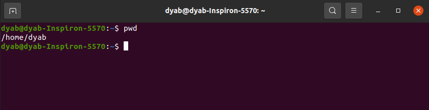

# Linux-commands

*   `pwd` print current working directory
    
*   `ls` list content

*   `cd` change directory

*   `mkdir` make a directory

*   `touch` create any file
    

*   `rm` remove files

*   `rm -r` remove folders, -r for recursively delete

*   `cd /` navigate to root directory
    

> note that everything in linux is a file, for example the above commands are files located in the `bin` directory.

*   `cd ~` navigate to home directory

*   `mv` move a folder from one directory to another, can be used to change the name of a folder too.
    

*   `cp -r` copy a folder

*   `ls -R` list content of a folder and the folders inside it (recursively)
    

*   `history` list all commands you typed, the commands are saved in .bash\_history file after closing the terminal
    

*   `ctrl + r` search for a specific command
    

*   `history + num ber` list last ‘number’ commands you typed
    

*   `cat file` displays content of file
    

*   `ls -a` list all files in a directory including hidden files

*   `uname -a` display os info
    
    

*   `cat /etc/os-release` display os release information
    

*   `lscpu` list cpu info
    

*   `lsmem` list memory info
    
