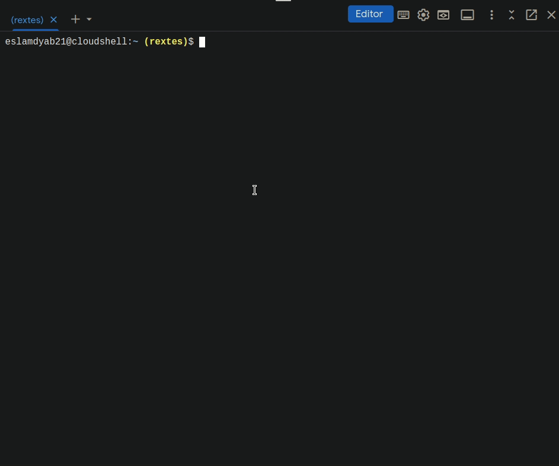

---
tags:
- linux
- programming
- course/devops

course:
- devops
- module1

date: 2022-06-30
---


# Bash-scripting


[Variables](#Variables)

[Conditions](#Conditions)

[Numeric compactors](#90725ef0-b056-49c9-bbcd-4a1cc42752fe)

[String operations](#b99b9d61-2b57-4696-b700-1a1bd96e7c5e)

[Passing arguments to a script](#25368090-6f2d-4aac-a364-8df251908143)

[Reading user input](#29cb6cd4-a09b-4600-b2de-cf8b39358e51)

[Loops](#2bdd13f6-5cb7-4cec-a63b-7829cc87681d)

[Functions](#6db1a98f-b7a7-4ff3-963f-2a99621f3afa)

*   it’s a way to execute more than one command together. the commands are written in bash files `file.sh` , the first line (shebang #!) must reference the bash location, by default it’s `#!/bin/bash` . to run the bash file: `./file.sh` or `bash file.sh` or `/bin/bash file.sh` 
    
    [
    
    [
    


### Variables

*   `file_name= config.yaml` variable in bash

*   `files = $(ls p0)` save the output of a command to a variable

[](Bash-scripting-images/Untitled%202.png)

[](Bash-scripting-images/Untitled%203.png)

### Conditions
```bash
if [condition]
then
	statement
else
	statement
fi
```

```bash
#!/bin/bash
echo "this isthe first line command in bash"

file_name=config.yaml

if [ -d "config" ]
then
   echo "reading config directory conternt"
   config_files=$(ls config)
else
   echo "config dir not found, creating one"
   mkdir config
fi


echo "using file $file_name to configure something"

echo "here are all files inside config dir: $config_files"
```


[](Bash-scripting-images/Untitled%204.png)

[](Bash-scripting-images/Untitled%205.png)

`-d` in if condition is a `file test operator` which checks if a directory exists or not. And there are other test operators:

[]

### Numeric compactors

[](Bash-scripting-images/Untitled%207.png)

*   `if [ “$num_files” -eq 10]`

### String operations

[](Bash-scripting-images/Untitled%208.png)

[](Bash-scripting-images/Untitled%209.png)

### Passing arguments to a script

[](Bash-scripting-images/Untitled%2010.png)

```bash
    #!/bin/bash
    
    file_name=$1
    
    config_dir=$2
    
    echo "-----------------"
    if [ -d "$config_dir" ]
    then
       echo "reading config directory conternt"
       config_files=$(ls $config_dir)
    else
       echo "config dir not found, creating one"
       mkdir $config_dir
       touch $config_dir/config.sh
       config_files=$(ls $config_dir)
    fi
    
    
    echo "-------------------"
    echo "using file $file_name to configure something"
    echo "-------------------"
    
    echo "here are all files inside config dir: $config_files"
```

[](Bash-scripting-images/Untitled%2011.png)

*   there are two special parameters which allow us to store all the user input parameters `$*`, and their number `$#`
    
    [](Bash-scripting-images/Untitled%2012.png)
    
    [](Bash-scripting-images/Untitled%2013.png)
    

### Reading user input

[](Bash-scripting-images/Untitled%2014.png)

[](Bash-scripting-images/Untitled%2015.png)

### Loops

[](Bash-scripting-images/Untitled%2016.png)

[](Bash-scripting-images/Untitled%2017.png)

*   loop with if
    [](Bash-scripting-images/Untitled%2018.png)
    ```bash
#!/bin/bash
echo "all params: $*"
echo "number of params: $#"
echo " "

for param in $*
do
  if [ -d "$param" ]
  then
	echo "$param is a directory, printing its content: "
	ls $param
	echo " "
  fi
done
```
    
    [](Bash-scripting-images/Untitled%2019.png)
    

*   while
    
    [](Bash-scripting-images/Untitled%2020.png)
 ```bash
#!/bin/bash

sum=0
while true
do
   read -p "enter a score: " score

   if [ "$score" == "q" ]
   then
	  echo " "
	  echo "Quiting....."
	  break
   fi

   sum=$(($sum+$score))
   echo "total score: $sum"
done
```

    
[](Bash-scripting-images/Untitled%2021.png)
    note that in line 17 `sum=$(($sum+$score))` if we typed it like this `sum=$sum+$score` it will concatenate two strings

### Functions

[](Bash-scripting-images/Untitled%2022.png)

[](Bash-scripting-images/Untitled%2023.png)

ex2

[](Bash-scripting-images/Untitled%2024.png)

```bash
#!/bin/bash

function sum(){
   total=$(($1+$2))
   return $total
}

sum 2 10
result=$?
# above two lines same as result=$(sum 2 10)

echo "2 + 10 = $result"
echo " "
echo "----------------------------"


function create_file() {
   file_name=$1
   is_shell_script=$2

   touch $file_name
   echo " file $file_name created"

   if [ "$is_shell_script" = true ]
   then
	  chmod u+x $file_name
	  echo "added execute permission"
   fi
   echo " "
}

create_file test.txt
create_file con.yaml
create_file script.sh true
```

[](Bash-scripting-images/Untitled%2025.png)

</br>
</br>

---
---
---


# Environment-variables


### Intro to environment variables

*   environment variables are a set of dynamic named values, stored within the system that are used by applications launched in shells. In simple words, an environment variable is a variable with a name and an associated value

*   `printenv` print all system env var
    [](Environment-Variables-images/Untitled.png)[](Environment-Variables-images/Untitled%201.png)
    

*   `printenv VAR` print the value of VAR environment variable
    [](Environment-Variables-images/Untitled%202.png)
    

*   environment variables can be accessed by linux programs and commands and also programming languages by typing $ before the variable `$USER` just like in bash script
    [](Environment-Variables-images/Untitled%203.png)

### Benefits of environment variables

Note that environment variables are not only a way for the os to store some info, it has other important use cases, like when running an application on a linux server which connects to google api, this connection have credentials (username and password).

how can we provide this sensitive credentials info in a secure way? we can’t just put them in our program in plain sight for anyone to see.

[](Environment-Variables-images/Untitled%204.png)

the answer is using environment variables, the application can access the sensitive data without showing them, we create an environment variables for every sensitive data entry.

[](Environment-Variables-images/Untitled%205.png)

also environment variables are used to make applications more flexible

[](Environment-Variables-images/Untitled%206.png)

### Operations on environment variables

*   `export ENV_VAR=value` creating env var

*   `unset ENV_VAR` deletes env var

[](Environment-Variables-images/Untitled%207.png)

💡Note that if we closed this terminal the created env vars will be gone, to save them permanently 
    we need to add export commands in the `.bashrc` file and then source it.

[](Environment-Variables-images/Untitled%208.png)

[](Environment-Variables-images/Untitled%209.png)

💡Note that the above `.bashrc` is unique for each user, which means that the env vars we created 
    won’t be accessible by other users. however we can make them global to all users by adding them in the `.bashrc` of the root which is located in `/etc/environment`

### The PATH environment variable

[](Environment-Variables-images/Untitled%2010.png)

is a list of directories to executable files separated by :

it tells the shell which directories to search for for the executables that we write in our commands

ex: when we type `ls` command, the shell searches in every directory in the PATH env var (every element in the list) until it finds it to execute it.

so if we added a directory of a new created exeuteble file to the PATH env var, we can execute it like `ls` anywhere.

Use case for me will be to save the github token in an env var.

*   Adding a custom command/program to the PATH env var
    
    *   creating the new script
        
        [](Environment-Variables-images/Untitled%2011.png)
        
    
    *   adding it to the PATH env var
    
    [](Environment-Variables-images/Untitled%2012.png)
    
    note that we didn’t use export with PATH because it’s already an existing env var, we’re just changing it
    
    [](Environment-Variables-images/Untitled%2013.png)
    

so the benefit here is that instead of specifying the entire path `/home/eslamdyab21/p0/welcome.sh` we just type `welcome.sh` anywhere


</br>
</br>

---
---
---
---

# Linux-commands

*   `pwd` print current working directory[](Linux-commands-images/Untitled.png)
    
*   `ls` list content

*   `cd` change directory

*   `mkdir` make a directory

*   `touch` create any file
    [](Linux-commands-images/Untitled%201.png)

*   `rm` remove files

*   `rm -r` remove folders, -r for recursively delete

*   `cd /` navigate to root directory
    [](Linux-commands-images/Untitled%202.png)

> note that everything in linux is a file, for example the above commands are files located in the `bin` directory.


*   `cd ~` navigate to home directory

*   `mv` move a folder from one directory to another, can be used to change the name of a folder too.
    [](Linux-commands-images/Untitled%203.png)

*   `cp -r` copy a folder

*   `ls -R` list content of a folder and the folders inside it (recursively)
    [](Linux-commands-images/Untitled%204.png)

*   `history` list all commands you typed, the commands are saved in .bash\_history file after closing the terminal
    [](Linux-commands-images/Untitled%205.png)

*   `ctrl + r` search for a specific command
    [](Linux-commands-images/Untitled%206.png)

*   `history + num ber` list last ‘number’ commands you typed
    [](Linux-commands-images/Untitled%207.png)

*   `cat file` displays content of file
    [](Linux-commands-images/Untitled%208.png)

*   `ls -a` list all files in a directory including hidden files

*   `uname -a` display os info
    
    [](Linux-commands-images/Untitled%209.png)

*   `cat /etc/os-release` display os release information
    [](Linux-commands-images/Untitled%2010.png)

*   `lscpu` list cpu info
    [](Linux-commands-images/Untitled%2011.png)

*   `lsmem` list memory info
    [](Linux-commands-images/Untitled%2012.png)

*   `sudo addusr name` add a user (needs to run as root)
    [](Linux-commands-images/Untitled%2013.png)

*   `su - name` switch user
    [](Linux-commands-images/Untitled%2014.png)

*   `sudo addgroup name` add a group
    [](Linux-commands-images/Untitled%2015.png)


</br>
</br>

---
---
---
---


# Manage-users-and-groups-and-their-permissions

[](Manage-users-and-groups-and-their-permissions-images/Untitled.png)

her there is only one user and its name is `htb-ac480198`


*   we can see the users and their assigned groups in `/etc/passwd`
    [](Manage-users-and-groups-and-their-permissions-images/Untitled%201.png)[](Manage-users-and-groups-and-their-permissions-images/Untitled%202.png)
  
  we can see `htb-ac480198:x:1000:1003:,,,:/home/htb-ac480198:/bin/bash` where
  
  -   `htb-ac480198` is the user name ,
  -   `x` is the password and its represented as x for security
  *   `1000` is the user id, assigned automatically when creating the user. and each user has a unique id
  *   `1003` is the group id that this user is in, and is stored in /etc/group
  *   `/home/htb-ac480198:` is the user home directory
  *   `/bin/bash` path of user shell


*   `adduser username` to add a user
    [](Manage-users-and-groups-and-their-permissions-images/Untitled%203.png)
    
    *   note that the user id and the group id get assigned automatically
    
    *   we can see that the user has been added in `/etc/passwd` with `UID=1001` and `GID=1004` and assigned a new directory `/home/tom` in the home directory
        
        [](Manage-users-and-groups-and-their-permissions-images/Untitled%204.png)
        
        [](Manage-users-and-groups-and-their-permissions-images/Untitled%205.png)
        
    

💡Note: whenever we create a new user, a new group is created automatically (primary group) to 
    that user with the same name as the user name and with a unique GID

*   `sudo passwd username` change the password of a user
    [](Manage-users-and-groups-and-their-permissions-images/Untitled%206.png)
    

*   `su - username` switch to another user
    [](Manage-users-and-groups-and-their-permissions-images/Untitled%207.png)

*   `sudo groupadd groupName` add a group
    [](Manage-users-and-groups-and-their-permissions-images/Untitled%208.png)[](Manage-users-and-groups-and-their-permissions-images/Untitled%209.png)
    
    we can see `devops:x:1005` is added

*   `sudo usermod -g anotherPrimaryGroup username` change the primary group of a user to another group
    [](Manage-users-and-groups-and-their-permissions-images/Untitled%2010.png)[](Manage-users-and-groups-and-their-permissions-images/Untitled%2011.png)
    *   we can see the GID is changed from 1004 to 1005 which is the GID of devops group
    
    *   now we don’t need the tom group, we can delete it `sudo delgroup tom`
        
        [](Manage-users-and-groups-and-their-permissions-images/Untitled%2012.png)
        
    

💡Note: we can add a user to multiple groups (a secondary group in addition to the primary group) 
    and that user will have the permissions of all the groups that he is in.

*   `sudo usermod -G secondrGgroup username` add the user to a secondary group in addition to the primary group, `secondrGgroup` can be one or a list (g1,g2,g3,…)
    [](Manage-users-and-groups-and-their-permissions-images/Untitled%2013.png)

*   note that if we add another `secondrGgroup` with the above command the `secondrGgroup`will be overwritten[](Manage-users-and-groups-and-their-permissions-images/Untitled%2014.png)

*   `sudo usermod -aG secondrGgroup username` to append to the existing `secondrGgroup`s.
    [](Manage-users-and-groups-and-their-permissions-images/Untitled%2015.png)
    

*   `groups username` displays the groups assigned to a user

*   we can add a user to a specific primary group a the creation of a new user instead of adding the primary group after the creation and then deleting the automatically created group
    
    *   `sudo useradd -g devops niklaus`
    [](Manage-users-and-groups-and-their-permissions-images/Untitled%2016.png)


*   `sudo gpasswd -d username group` delete a user from a group
    [](Manage-users-and-groups-and-their-permissions-images/Untitled%2017.png)


</br>
</br>

---
---
---
---


# Owners-and-permissions


Ownership
---------

*   the user who created a file is the owner of that file, and the primary group of that user is the primary group of that file. and `ls -l` displays the ownership and permissions info.
    
    [](Owners-and-permissions-images/Untitled.png)
    
    here we created a text file called `info.txt` with eslamdyab21 user and eslamdyab21 group, because we currently logged as that user. `eslamdyab21@cloudshell:~/p0 (rextes)`
    

*   if we switch to tom user whose primary group is devops, its info will be displayed
    
    [](Owners-and-permissions-images/Untitled%201.png)
    

*   we can change the owner user and group of a file, `sudo chown user:group file`
    
    [](Owners-and-permissions-images/Untitled%202.png)
    

*   `ls -l /etc/` see who owns the files in etc
    
    [](Owners-and-permissions-images/Untitled%203.png)
    
    they are owned by root because they are system files which are created by the system itself.
    

*   `sudo chown user file` change only the user owner of a file
    
    [](Owners-and-permissions-images/Untitled%204.png)
    

*   `sudo chgrp group file` change only the group owner of a file
    
    [](Owners-and-permissions-images/Untitled%205.png)
    

Permissions
-----------

[](Owners-and-permissions-images/Untitled%206.png)

*   r —> read

*   w —> write

*   x —> execute

*   d —> directory

[](Owners-and-permissions-images/Untitled%207.png)

here if we look at `main.py`

`-rwx``r--``r--` `1 eslamdyab21 eslamdyab21 48 Jun 29 13:13 main.py`

*   the owner user (eslamdyab21) has read, write and execute permissions

*   the owner group (eslamdyab21) has read permissions only

*   the other groups has read permissions only

this means only eslamdyab21 user can modify and run this script.

[](Owners-and-permissions-images/Untitled%208.png)

if we switch to tom user:

[](Owners-and-permissions-images/Untitled%209.png)

to give tom write permissions we need to change the permissions for the other group (which includes devops group which tom is in)

*   u for user

*   g for group

*   o for other

*   a for all

*   `sudo chmod o+w file`
    
    [](Owners-and-permissions-images/Untitled%2010.png)
    
    now we can edit the file in other groups
    

*   `sudo chmod o-w file` to take the write permission from other groups
    
    [](Owners-and-permissions-images/Untitled%2011.png)
    

*   `sudo chmod g+w file` add write permission to eslamdyab21 group
    
    [](Owners-and-permissions-images/Untitled%2012.png)
    

*   `sudo chmod a+r file` add read permission for all users
    
    [](Owners-and-permissions-images/Untitled%2013.png)
    

*   we can specify all the permissions at once `sudo chmod o=rwx file`
    
    [](Owners-and-permissions-images/Untitled%2014.png)
    
    [](Owners-and-permissions-images/Untitled%2015.png)
    

we can change the permission for the user, group and other in one command using the binary method

[](Owners-and-permissions-images/Untitled%2016.png)

*   `sudo chmod 754 file`
    
    *   1st digit 7=111 —> r=1, w=1, x=1 —> for user
    
    *   2nd digit 5=101 —> r=1, w=0, x=1 —> for group
    
    *   3rd digit 4=100 —> r=1, w=0, x=1 —> for other
    
    [](Owners-and-permissions-images/Untitled%2017.png)
    

💡

Note: we can do the same for hidden files with `ls -la`

[](Owners-and-permissions-images/Untitled%2018.png)


</br>
</br>

---
---
---
---


# Package-manager


APT
-----------
*   apt package manager is used to install packages/programs in linux.

*   apt install the program with its dependencies

*   it downloads those packages from the internet from hosted repositories, and those repositories can be found in `/etc/apt/sources.list`
    [](Package-manager-images/Untitled.png)

Snap
------------
*   some applications are not in apt, an alternative is `snap`

*   snap snaps all the dependencies in one package and downloads it, this means if tow apps have some shared dependencies it will download them two times one for each app. But apt will only download them once.

*   so if an app is available in both apt and snap, it’s better to download it from apt (less space)


PPA Repository
---------------------------------------
*   some applications are not in apt and snap, an alternative is adding a `PPA repository`

*   Personal Package Archive (PPA) are provided by the community, usually used by developers to provide updates more quickly than in the official Ubuntu repositories.

*   because it’s personal (any one can create it) be aware of possible risks before adding a PPA.

*   after adding the PPA (it will be added to the sources.list) and when installing an app the apt toll will now search in the PPA added repo too to fetch the package from that repo.

[](Package-manager-images/Untitled%201.png)

Different source based distributions have different package mangers
------------------------------------------------------------------------------------------------------------------------------------------------------

*   Debian based: - Ubuntu - Debian - Mint Have APT and APT-GET

*   Red Had based: - RHEL - CentOS - Fedora Have Yum

The concepts of APT and YUM are the same with some differences in the repos, some will have more or newer versions of packages.

And when choosing a distribution for the server the above factors will determine which distro to install.

</br>
</br>

---
---
---
---


# Pipelines

>in linux commands, the output of one command can be the input to another command. This is known as piping

Pipelines with less
----------------------------------------------

for example `cat /var/log/syslog` output the log data in the shell directly, but it’s not user friendly because it outputs all the data in one big page.

a tool called `less` can take this data and displays it in different pages making it easier to read.

[](Pipelines-images/cat_logg.gif)

*   `cat /var/log/syslog | less` pipline that pass the output of cat to the input to less
    [](Pipelines-images/cat_log_less.gif)
    
    type `q` to quite, `b` to navigate up, `space` to navigate down

*   `history | less`
    [](Pipelines-images/history_less.gif)


Pipelines with grep
-------------------------------------------------

*   `history | grep “sudo chmod”` filter the history to find lines which have “`sudo chmod`” in them.
    [](Pipelines-images/Untitled.png)

*   `history | grep sudo | less`
    [](Pipelines-images/grep_less.gif)

*   `cat README-cloudshell.txt | grep cloud`
    [](Pipelines-images/grep_cloud.gif)
    

Redirecting
------------------------------

*   `history | grep sudo > sudo-commands.txt`
    [](Pipelines-images/redirect.gif)


#### If we want to append to a copy of `sudo-commands.txt`,
*   `history | grep tom` `>>` `sudo-tom-commands.txt`
    [](Pipelines-images/tom.gif)


>Note: the above methods are useful in a scenario when we filter the log file for a particular application and direct/save this log info to a file to share with someone for troubleshooting

*   `ls; sleep 2; echo "Hi after waiting and ls”`
    [](Pipelines-images/sleep.gif)
    those commands are independent of each other, no piping no redirecting


</br>
</br>

---
---
---
---


# Vim-editor


Basics
-----------------
*   install vim `sudo apt install vim`

*   `vim file` opens a file in a `command mode` , in command mode you can’t edit the file, but you can do anything else like navigate, search,delete, undo,…..

*   `vim` `readme.md`
    [](Vim-editor-images/Untitled.png)

*   to insert text type `i` to switch to the insert mode
    [](Vim-editor-images/Untitled%201.png)
    
    [](Vim-editor-images/Untitled%202.png)
    

*   to save the edit we need to go back to common mode first and then exit, to go back to common mode type `esc key` , then type `:wq` (write and quite) to write the changes and quite.
    [](Vim-editor-images/Untitled%203.png)
    
    [](Vim-editor-images/Untitled%204.png)

*   if you added some text and you want to quit without saving the changes you made, go to common mode and type `:q!`
    [](Vim-editor-images/Untitled%205.png)
    
    [](Vim-editor-images/Untitled%206.png)

*   `vim file` creates a file

Some useful commands/shortcuts
----------------------------------------------------------------------------------------

[](Vim-editor-images/Untitled%207.png)

*   to delete a line you can type `dd` in common mode instead of deleting character by character.

*   to delete next N lines, type `dNd` like deleting next 4 lines `d4d`
    [](Vim-editor-images/Untitled%208.png)

*   to undo type `u`
    [](Vim-editor-images/Untitled%207.png)

*   to jump to the end of the line type capital A `Shift + A` and it will switch to insert mode too.

*   to jump to the beginning of the line type `0`

*   to jump to line number N type NG like jumping to line number 12, type `12G`

*   to search for a word in the file type `/word` and it will find the first match, to go to the next match type `n`, to go to the previous match type `N`
    [](Vim-editor-images/Untitled%209.png)
    

*   to replace a string who is frequent like nginx with another, type `:%s/stringName/newName` like `:%s/nginx/new-app`
    [](Vim-editor-images/Untitled%2010.png)
    
    [](Vim-editor-images/Untitled%2011.png)