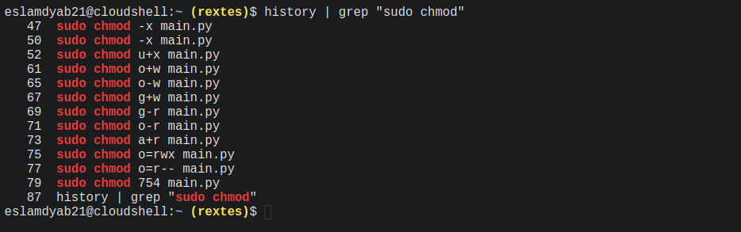
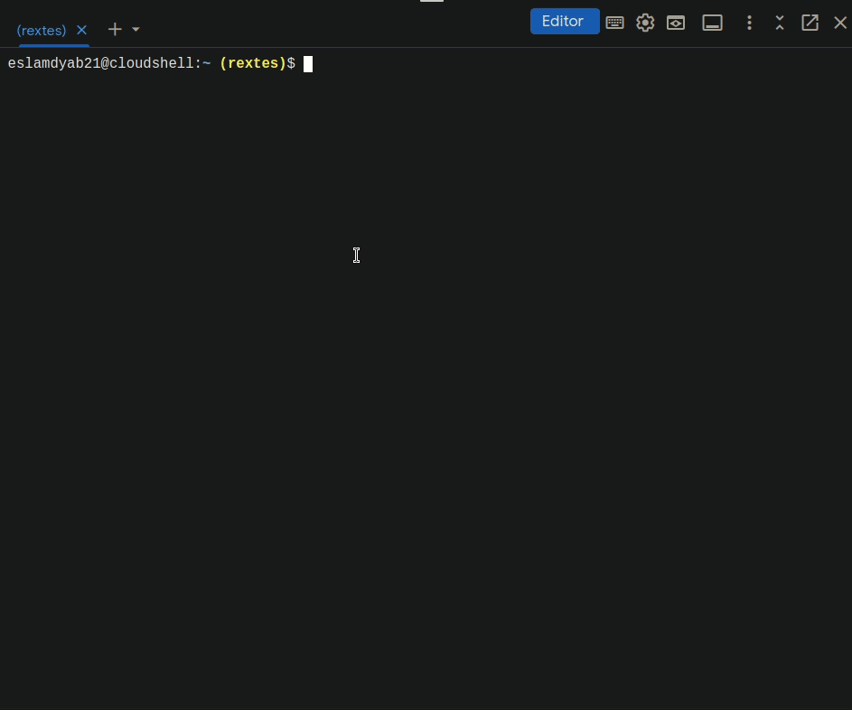
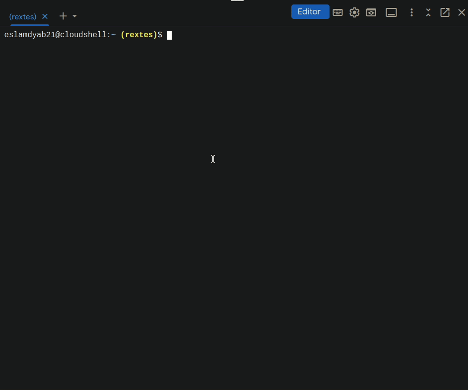
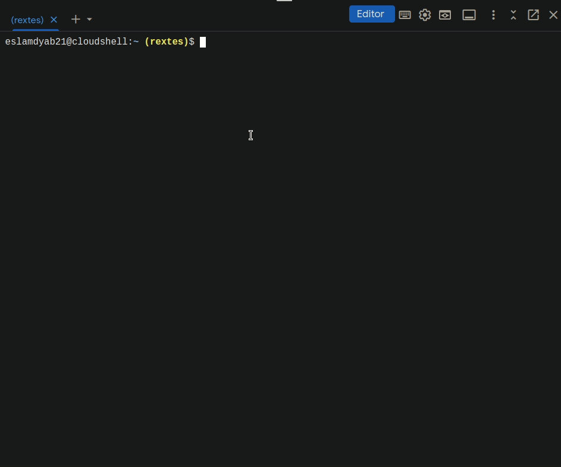

>in linux commands, the output of one command can be the input to another command. This is known as piping

Pipelines with less
----------------------------------------------

for example `cat /var/log/syslog` output the log data in the shell directly, but it’s not user friendly because it outputs all the data in one big page.

a tool called `less` can take this data and displays it in different pages making it easier to read.

*   `cat /var/log/syslog | less` pipline that pass the output of cat to the input to less
    
    
    type `q` to quite, `b` to navigate up, `space` to navigate down

*   `history | less`
    

Pipelines with grep
-------------------------------------------------

*   `history | grep “sudo chmod”` filter the history to find lines which have “`sudo chmod`” in them.
    

*   `history | grep sudo | less`
    

*   `cat README-cloudshell.txt | grep cloud`
    
    

Redirecting
------------------------------

*   `history | grep sudo > sudo-commands.txt`
    

#### If we want to append to a copy of `sudo-commands.txt`,
*   `history | grep tom` `>>` `sudo-tom-commands.txt`
    

>Note: the above methods are useful in a scenario when we filter the log file for a particular application and direct/save this log info to a file to share with someone for troubleshooting

*   `ls; sleep 2; echo "Hi after waiting and ls”`
    
    those commands are independent of each other, no piping no redirecting