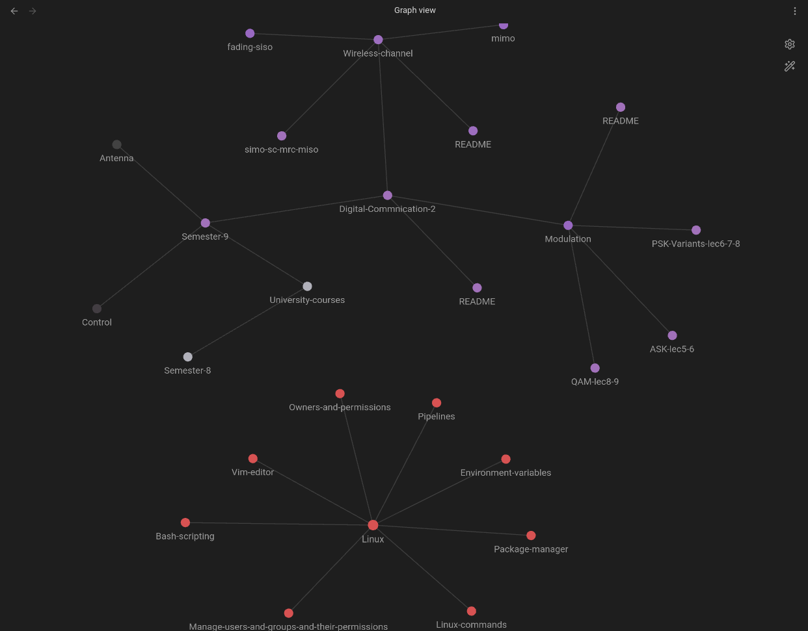

# Knowledge-Hub

This repo has knowledge that I consume from different sources, starting from random you-tube educational videos to university courses. Here will be the home of notes I take to comeback to it later when in need. This repo is maintained using Obsidian.