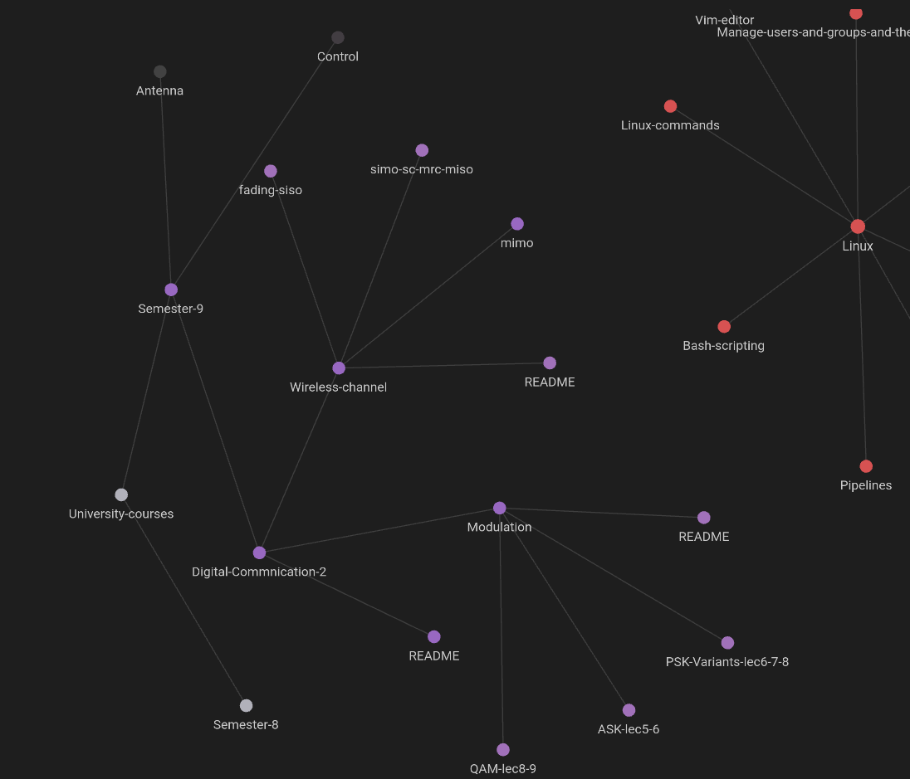

### Here are `digitally written pdf` files for different lecture topics in dr.Karem part like:
- `Signal space` in lec4 and lec5
- `ASK` in lec5 and lec6 
- `PSK and its Variants` in lec 6,7,8
- `QAM` in lec8 and lec9

### Also for dr.Karmose part like: 
- `MIMO and SIMO and Fading` inside `mimo` folder
- And there is a repo for the final project `"OFDM"` in my github page.

The notes are taken in a clean nice way for readers.
Also the source `.xoj` files (this notes are taken in an app called Xornal which saves the notes in `.xoj` format) for any feuter students who wants to contine on it or use the same configurations, ore for me in the future.
